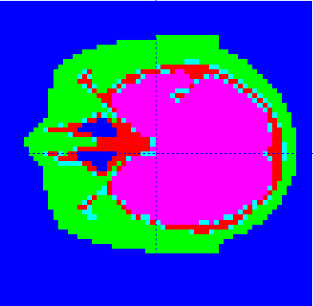

# DICOM to MCNP parser

DICOM-MCNP-Parser is a DICOM to MCNP parser written in python. This parser can read a DICOM file section and convert to an MCNP input file. This is strictly a "geometry-converter" with the purpose of converting the informaton contained within a DICOM image into an MCNP input using macrobodies. After the conversion, the user still has to set up physics, particle importances, source as well as tallies tailored to her/his needs. 

This code was developed by Cheng Yi in his graduation thesis under the supervision of Ilker Meric and Icaro Valgueiro Malta Moreira.

Supported by Høgskulen på Vestlandet and Tianjin University of Technology.
<br>


# Installation

This script requires you to install pydicom(https://pydicom.github.io).
Download the dicom_mcnp_parser.py file and add to your project.

# Usage

Import the package "dicom_mcnp_parser".

```python
import dicom_mcnp_parser
```

Call "parse_dicom()" function, passing the path to the dicom file and the path to the exported imp(mcnp) file.

```python

from dicom_mcnp_parser import parse_dicom

parse_dicom("80_dicom_125mm.dcm", "80_dicom_125mm.imp")

```

If you use the phantom file provided by this repository, you should cite the following paper:

Giacometti, V., Guatelli, S., Bazalova-Carter, M., Rosenfeld, A.B., Schulte, R.W., "Development of a high resolution voxelised head phantom for medical physics applications", (2017) Physica Medica, 33, pp. 182-188  

# Example
Here is an example image as visualized in the Moritz visualization software.



# Features

 - Parser from MCNP

# Contributors

* Cheng Yi ([ChengYi1997][])
* Icaro Valgueiro Malta Moreira ([ivmmoreira][])
* Ilker Meric ([ilkermeric][])

[ChengYi1997]:            https://github.com/ChengYi1997
[ivmmoreira]:  https://github.com/ivmmoreira
[ilkermeric]:  https://github.com/ilkermeric
